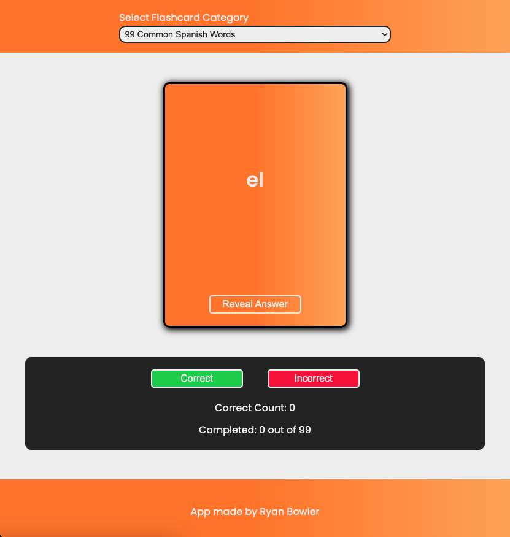

# Spanish-Flashcard-App

## Overview

This repository contains the source code for a Spanish flashcard app. The app is designed to help users learn and practice Spanish vocabulary and phrases effectively. Whether you're a beginner or an advanced learner, this app can assist you in expanding your language skills. Built with React!

## Features

- Interactive flashcards for learning Spanish.
- Multiple flashcard categories, including common words, greetings, food, and more.
- User-friendly interface for easy navigation.
- Score counter to keep track of progress.
