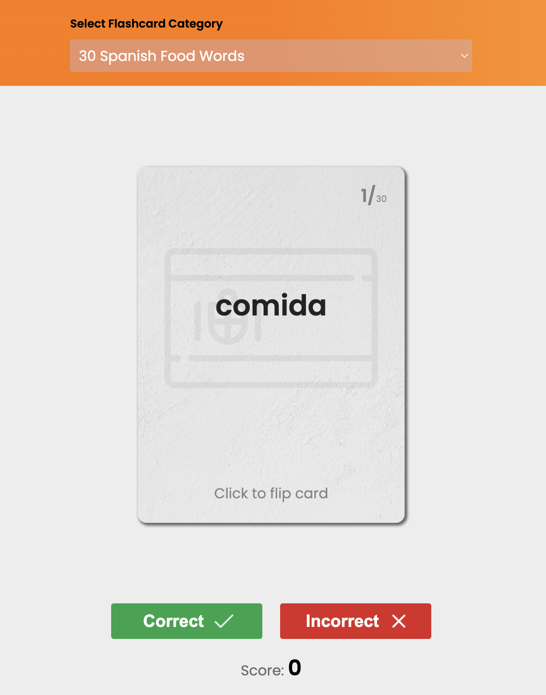

# Spanish Flashcard App



**Spanish Flashcard App** is a React web application designed for learning Spanish vocabulary through flashcards. It's a project developed by Ryan Bowler, showcasing skills in web development, React, and CSS animations.

## Features

- **React**: Built with React, a popular JavaScript library for building user interfaces.
- **Create React App**: Utilizes Create React App for project bootstrapping and development.
- **CSS**: Styled with CSS to create animations and enhance the user interface.
- **useReducer and useState**: Implements React's `useReducer` and `useState` hooks for state management.
- **Local JSON Data**: Uses JSON data stored locally to provide a variety of Spanish language flashcards across different categories.
- **Flashcard Games**: Offers various flashcard games to learn Spanish vocabulary, including shuffling through cards and flipping them to reveal translations.
- **CSS Animations**: Utilizes CSS animations heavily to provide an engaging user experience, giving the illusion of a real deck of cards when shuffling and flipping.

## Installation

1. Clone the repository:

   ```bash
   git clone https://github.com/your-username/spanish-flashcard-app.git
   ```

2. Navigate to the project directory:

   ```bash
   cd spanish-flashcard-app
   ```

3. Install dependencies:

   ```bash
   npm install
   ```

4. Start the development server:

   ```bash
   npm start
   ```

5. Open your browser and navigate to `http://localhost:3000` to view the app.

## Usage

- Choose a category of Spanish flashcards from the available options.
- Shuffle through the flashcards to test your knowledge.
- Flip the cards over to reveal their translations and learn Spanish vocabulary.

## Contributing

Contributions are welcome! Feel free to open an issue or submit a pull request for any improvements or new features you'd like to see.

## License

This project is licensed under the [MIT License](LICENSE).

## Acknowledgements

- [React](https://reactjs.org/)
- [Create React App](https://create-react-app.dev/)
- [CSS Animations](https://developer.mozilla.org/en-US/docs/Web/CSS/animation)

## Contact

For any inquiries or feedback, please contact Ryan at ryanbprog@gmail.com.
